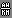

Num | Char | Max | Inav | Description
--- | ---- | -- | -- | ----------------------------
001 | x | x | | RSSI icon 
002 |  |  | | Left arrow
003 |  |  | | Right arrow
004 |  |  |  | Throttle icon left
005 |  |  |  | Throttle icon right
006 |  |  |  | ?
007 |  |  |  | MAH unit
008 |  |  |  | ?
009 |  |  |  | ?
010 |  |  |  | ?
011 |  |  |  | ?
012 |  |  |  | M unit (meters)
013 |  |  |  | °F unit
014 |  |  |  | °C unit
015 |  |  |  | FT unit (feet)
016 |  |  |  | ?
017 |  |  |  | ?
018 |  |  |  | ?
019 |  |  |  | ?
020 |  |  |  | ?
021 |  |  |  | ?
022 |  |  |  | Wind icon horizontal
023 |  |  |  | Wind icon vertical
024 |  |  |  | Compass N
025 |  |  |  | Compass S
026 |  |  |  | Compass E
027 |  |  |  | Compass W
028 |  |  |  | Compass line
029 |  |  |  | Compass dot
030 |  |  |  | Satellite left
031 |  |  |  | Satellite right 